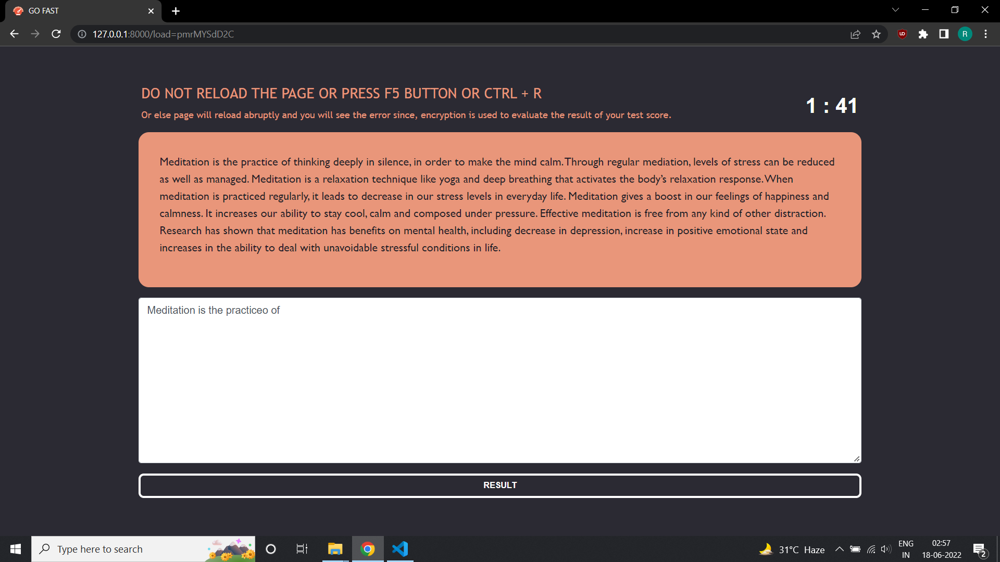
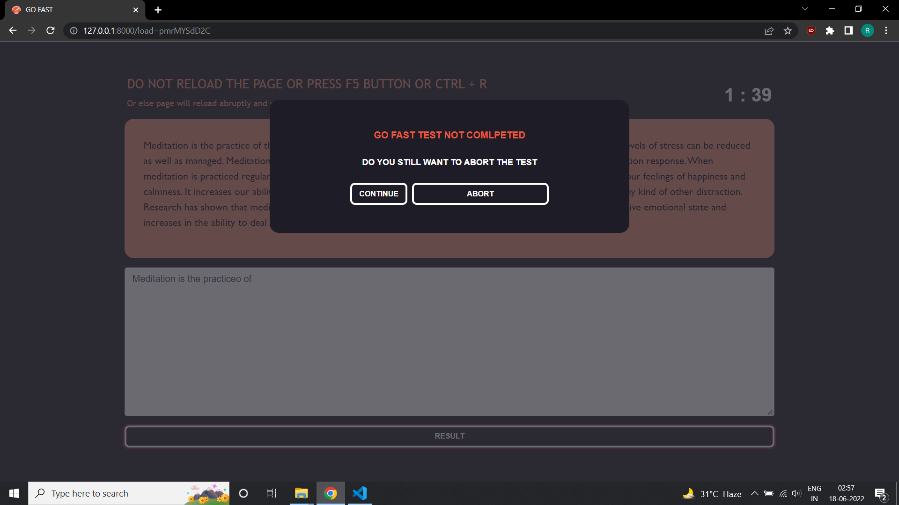
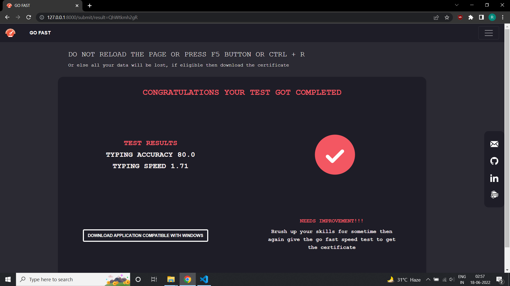
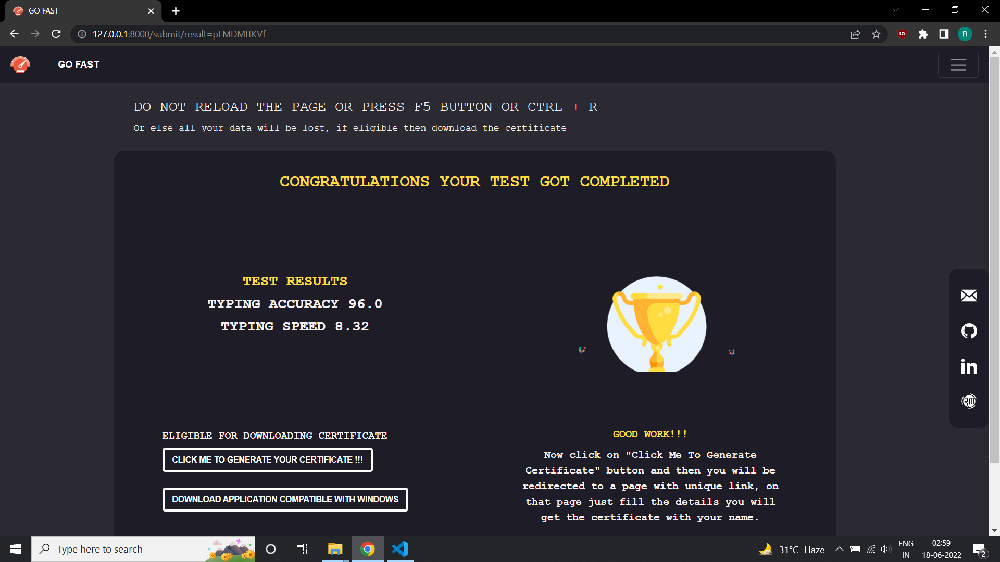
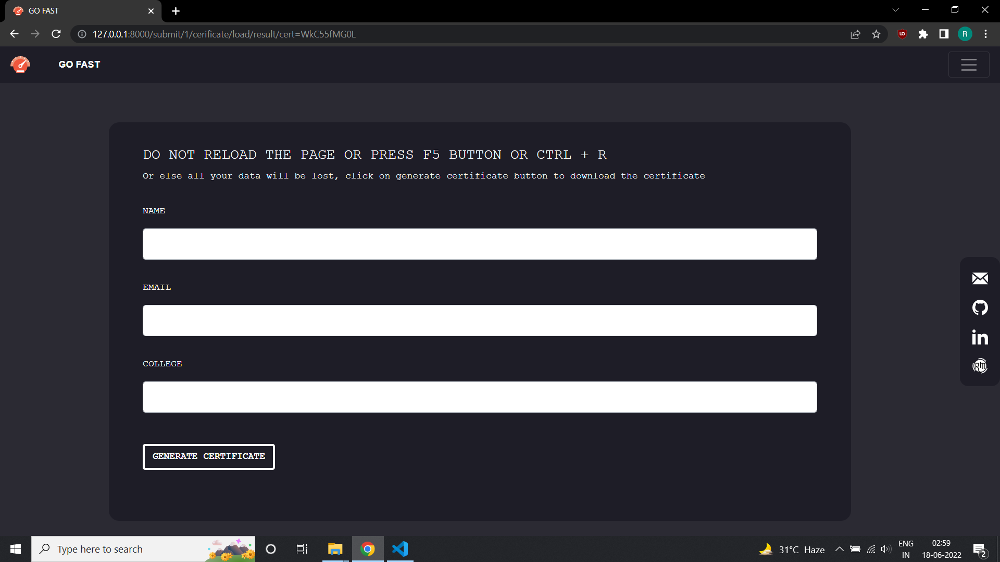
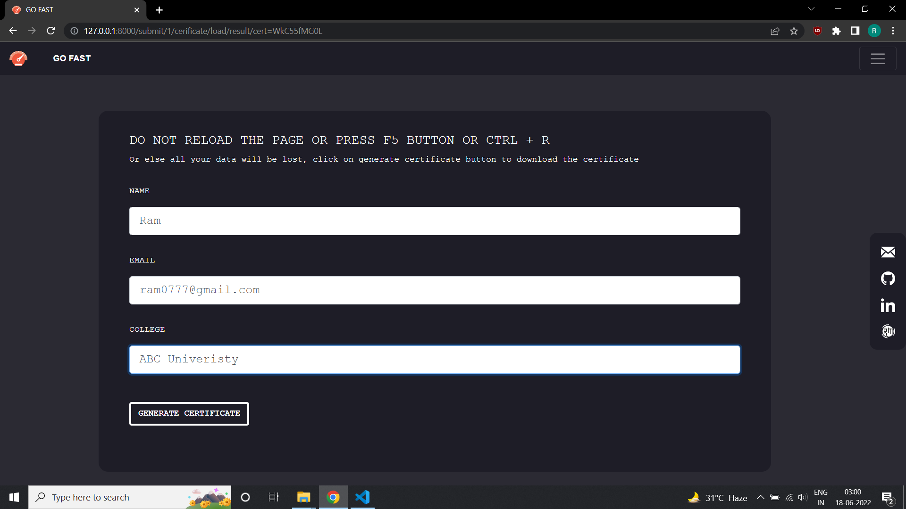

# About


### Some Commands
1. Run this command to get all the requirements that are needed to be installed on your machine written
in the requirements.txt file
    ```bash 
    pip freeze > requirements.txt
    ```
2. Run this command to install all those requirements in your environment
    ```bash
    pip install -r requirements.txt 
    ```
## Screenshots

 

 

 

 

 

 

 



